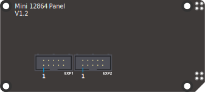
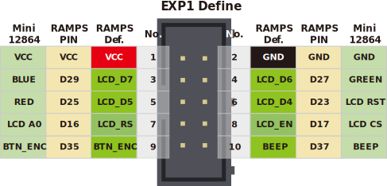
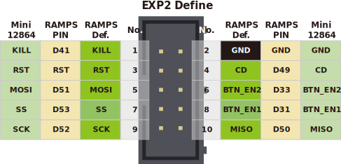
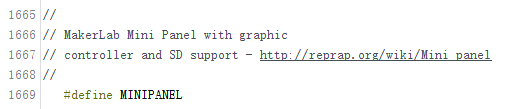
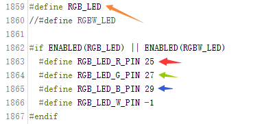
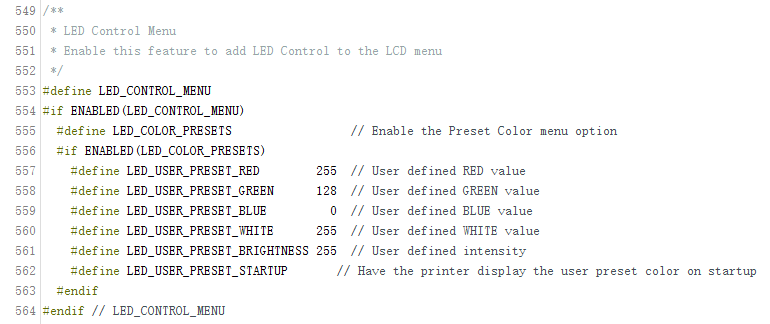
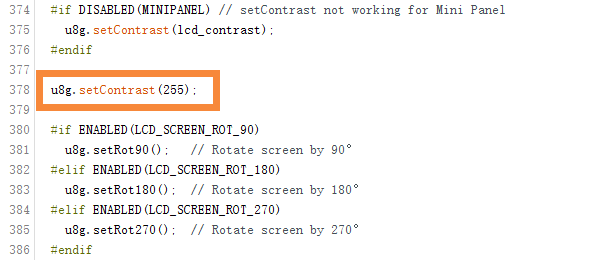
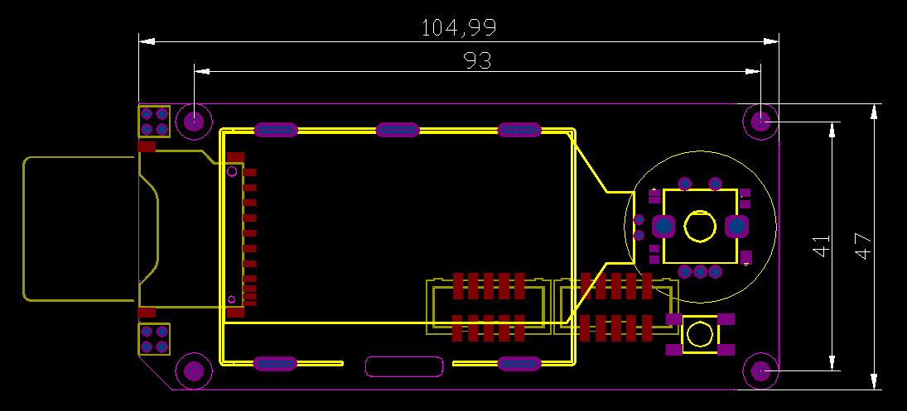

# Mini-12864-Panel

## Product Introduction


这是一个便宜，带RGB指示灯，通用于marlin的显示屏，支持脱机打印，分辨率为12864，显示区域为2.4’‘，SD卡座可以为侧式或者立式，方便不同的安装场合，非常适用于小型3D打印机。

This is a opensouce, cheap, with RGB indicator, common to marlin's display, supports offline printing, resolution is 12864, display area is 2.4'', SD card holder can be side or vertical, convenient for different installation occasions Ideal for small 3D printers.

There are two versions, one with only two RGB LEDs around the encoder, the backlight is fixed color; the other one backlight is also RGB.

## Features

- 2.4" inch high contrast Graphic LCD
- Black-gray/black-green/white-black/white-blue/green-black, 5 display styles
- SPI communication to host micro-controller
- Support Vertical or side SD slot with card detect
- Rotary Encoder 
- Configurable RGB LED light
- Software configurable contrast setting
- 3D printable case and mount STL file 
- EXP1 & EXP2  RAMPS Compatible socket


## Application

3D printer，CNC machines ，Other micro controller projects


## Typical  Wiring







## 注意/NOTICE：

| SCH                                                | Description                                                  |
| -------------------------------------------------- | ------------------------------------------------------------ |
|  | 为了兼容某些主板，如RAMPS1.4，FYSETC mini12864 设置了 RST(R3) 和 KILL(R4) 的可选择电阻。目前，有些主板（S6/Spider）将 KILL 换成 5V，此时，请确认 mini12864 上 R4处于空贴状态，否则按下屏幕上的按钮会致使 5V 与 GND 短路，长时间操作会导致主板损坏。<br/>   In order to be compatible with some motherboards, such as RAMPS1.4, mini12864 is equipped with RST (R3) and KILL (R4) optional resistors. At present, some motherboards (S6/Spider) change the KILL to 5V. At this time, please make sure that R4 on the mini12864 is in the empty state, otherwise pressing the button on the screen will cause a short circuit between 5V and GND, and long-term operation will cause the motherboard to be damaged. |

## Firmware config

This screen driver is ST7567 and is compatible with the marlin Mini panel. It has been tested well, but the following configuration is required.

**Before you start, please install the latest version of U8glib.**

##### Step1. changes the pins.

On a RAMPS-compatible board, you need to make the following changes in pins_RAMPS.h:

``` cpp tab='pins_RAMPS.h'
 #elif ENABLED(MINIPANEL)
      #define BEEPER_PIN 37
      // Pins for DOGM SPI LCD Support
      #define DOGLCD_A0  16
      #define DOGLCD_CS  17
      #define LCD_BACKLIGHT_PIN -1 // backlight LED on A11/D65
      #define LCD_RESET_PIN  23
      #define SDSS   53

      #define KILL_PIN -1
      #define LCD_CONTRAST 200
      #define BTN_EN1 31
      #define BTN_EN2 33
      #define BTN_ENC 35  //the click switch
    
      #define SD_DETECT_PIN 49
```

On a our F6 board, you need to make the following changes in pins_FYSETC_F6_V13.h:


``` cpp tab='pins_RAMPS.h'
//////////////////////////
// LCDs and Controllers //
//////////////////////////

    // #define LCD_PINS_RS         16
    // #define LCD_PINS_ENABLE     17
    // #define LCD_PINS_D4         23
    // #define LCD_PINS_D5         25
    // #define LCD_PINS_D6         27
    // #define LCD_PINS_D7         29
    
    // Pins for DOGM SPI LCD Support
    #define DOGLCD_A0  16
    #define DOGLCD_CS  17
    #define LCD_BACKLIGHT_PIN -1 
    #define LCD_RESET_PIN  23
    #define LCD_CONTRAST 255
    
    #define SDSS   53
    #define BEEPER_PIN          37
    #define BTN_EN1             31
    #define BTN_EN2             33
    #define BTN_ENC             35
    #define SD_DETECT_PIN       49
    #define KILL_PIN            41
```
##### Step2. Config the configuration.h.





##### Step3. Config the configuration_adv.h.



##### Step4. add the codes in ultralcd_impl_DOGM.h.



## Attention

-TBD-

## FAQ

-TBD-


## Attachments
### 1. Schematic

---------


### 2. Dimensions

---------



**For detailed dimensions please check dwg/step file on github.**

## Shop
---
- [LCD](  )

## Tech Support
---
Please submit any technical issue into our [forum](http://forum.fysetc.com/) 


```

```